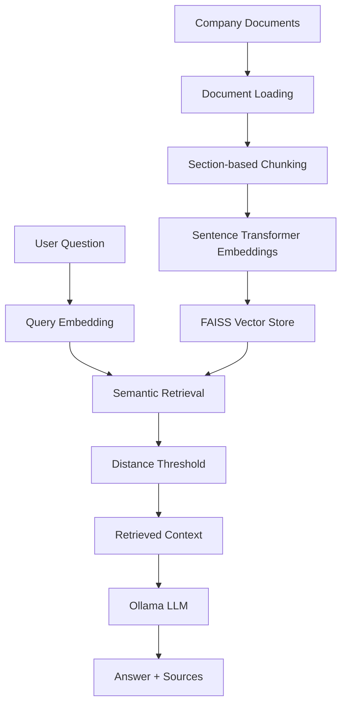

# Personal Enterprise RAG Assistant

A document-based Retrieval-Augmented Generation (RAG) assistant built with Python, local LLM inference, semantic retrieval, and evaluation.

The project is designed as a small enterprise-style AI system that answers questions from internal company documents while handling unsupported questions and retrieval/generation failures safely.

## Project Overview

The assistant uses company documents as its knowledge source and follows this pipeline:



The current example knowledge base represents internal documents from a fictional company, **NordicTech**.

## Features

* Document loading from local `.txt` files
* Section-based document chunking
* Sentence Transformer embeddings
* FAISS vector similarity search
* Configurable retrieval distance threshold
* Local LLM generation using Ollama
* Context-restricted answer generation
* Source information shown with answers
* Unsupported-question handling
* LLM error/fallback handling
* Application logging
* Configuration through environment variables
* Evaluation of retrieval and generation quality
* End-to-end regression testing

## Project Structure

```text
personal-rag-ai-assistant/
│
├── data/
│   └── documents/
│       ├── employee_handbook.txt
│       ├── it_support_policy.txt
│       └── leave_policy.txt
│
├── evaluation/
│   ├── test_end_to_end.py
│   ├── test_generation.py
│   ├── test_questions.py
│   ├── test_threshold.py
│   └── test_unsupported_questions.py
│
├── src/
│   ├── config.py
│   ├── logging_config.py
│   │
│   ├── embeddings/
│   │   └── create_embeddings.py
│   │
│   ├── generation/
│   │   ├── generator.py
│   │   └── __init__.py
│   │
│   ├── ingestion/
│   │   ├── load_documents.py
│   │   ├── chunk_documents.py
│   │   └── __init__.py
│   │
│   └── retrieval/
│       ├── search.py
│       └── vector_store.py
│
├── .env
├── .gitignore
└── README.md
```

## Technology Stack

* **Python** — application development
* **Sentence Transformers** — text embeddings
* **FAISS** — vector similarity search
* **Ollama** — local LLM inference
* **NumPy** — numerical processing
* **Pickle** — storing chunk metadata
* **python-dotenv** — environment-based configuration

## Configuration

The project keeps model configuration outside the application code.

The Ollama model is configured through `.env`:

```text
OLLAMA_MODEL=qwen2.5:1.5b
```

The embedding model currently defaults to:

```text
all-MiniLM-L6-v2
```

The retrieval distance threshold is configured in `src/config.py`.

Sensitive configuration files such as `.env` are excluded through `.gitignore`.

## Retrieval Design

Documents are divided into meaningful sections rather than using arbitrary fixed-size chunks.

Each retrieved result contains:

* filename
* section
* content
* vector distance

A distance threshold is used to prevent weakly related documents from being passed to the generation step.

The current threshold is:

```text
1.2
```

The threshold was evaluated against the project's retrieval test questions before being used by the application.

## Generation

The generation component uses a local Ollama model.

The prompt instructs the model to:

1. Use only the retrieved context.
2. Provide a clear answer.
3. Avoid adding information not present in the documents.
4. State that the information is unavailable when the provided documents do not contain enough information.

This provides a basic grounding mechanism for the generated answers.

## Evaluation

The project includes separate evaluations for retrieval, generation, unsupported questions, threshold behavior, and end-to-end behavior.

### Retrieval Evaluation

With the current section-based chunking:

* Top-1 retrieval: **10/10 (100%)**
* Top-3 retrieval: **10/10 (100%)**
* Information retrieval coverage: **10/10 (100%)**

### Generation Evaluation

Current generation evaluation:

* Key-information accuracy: **10/10 (100%)**

### Unsupported Questions

Unsupported questions are tested to ensure the system does not invent answers when information is absent from the knowledge base.

Current unsupported-question evaluation:

* **4/4 (100%)**

### End-to-End Regression Test

The end-to-end regression suite currently contains six representative questions covering:

* factual document questions
* working-hours information
* remote-work information
* password-reset information
* unsupported company information

Current result:

```text
End-to-end accuracy: 6/6 (100.0%)
```

## Error Handling

The application handles LLM generation failures without terminating the application.

For example, when the configured Ollama model is unavailable, the application logs the error and returns a user-friendly fallback message instead of crashing.

## Logging

The application logs important runtime events such as:

* received questions
* number of retrieved chunks
* best retrieval distance
* retrieved source
* generation failures

This provides basic runtime visibility while keeping the implementation lightweight.

## Security and Configuration

The project includes basic security and configuration practices appropriate for the current local application:

* `.env` is excluded from Git.
* `.venv` is excluded from Git.
* generated `__pycache__` files are excluded from Git.
* the local `vector_store` is excluded from Git.
* model configuration is separated from application logic.
* no API keys or hard-coded credentials are stored in the source code.

## Running the Application

Activate the virtual environment and run the generator as a module:

```powershell
python -m src.generation.generator
```

Then enter a question such as:

```text
How many vacation days do employees get?
```

The assistant returns an answer and the retrieved source.

Type:

```text
exit
```

to stop the application.

## Running the Tests

Run the end-to-end regression test with:

```powershell
python -m evaluation.test_end_to_end
```

Other evaluation modules can be run using the same module-based approach.

## Example

**Question**

```text
How many vacation days do employees get?
```

**Answer**

```text
Employees are entitled to 25 paid vacation days per calendar year.
```

**Source**

```text
leave_policy.txt — Annual Vacation
```

## Current Limitations

This is currently a local prototype rather than a production deployment.

Current limitations include:

* local document storage
* local FAISS vector store
* local Ollama inference
* text-file knowledge sources
* command-line interface
* basic logging rather than a full observability platform
* basic evaluation rather than a large production evaluation dataset
* no authentication or multi-user access control
* no web UI yet

These limitations are intentional so that the core RAG pipeline can be evaluated before adding additional application layers.

## Future Improvements

Planned improvements include:

* user interface
* expanded evaluation dataset
* additional retrieval experiments
* improved observability
* production-oriented deployment considerations

## Project Goal

The goal of this project is to demonstrate practical understanding of building and evaluating an LLM application, including:

* document ingestion
* embeddings
* vector retrieval
* retrieval thresholds
* grounded generation
* source traceability
* error handling
* evaluation
* configuration management
* clean project structure
* basic security practices


